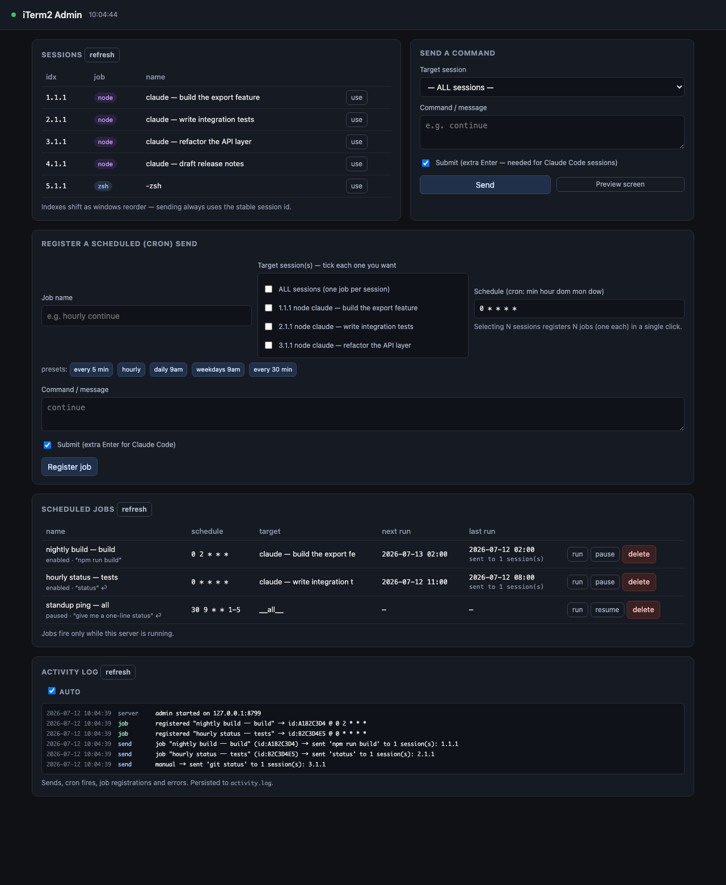

# itermon — iTerm2 Session Monitor & Controller

[](https://www.npmjs.com/package/itermon)
[](https://www.buymeacoffee.com/vectechlimited)

Monitor every running **iTerm2** session from one place, send commands to any of
them, and schedule recurring sends with cron — from a CLI or a local web admin.

> **Published on npm** as [`itermon`](https://www.npmjs.com/package/itermon):
> `npm install -g itermon` (macOS · needs Python 3.10+ & iTerm2).

- **macOS only** (uses iTerm2's AppleScript interface)
- **Zero dependencies** — pure Python 3 standard library; no `pip install`
- **No iTerm2 setup** — uses AppleScript, so the Python API and its preferences
  are not required (macOS will prompt once to allow automation; approve it)



<sub>The web admin: live session list, send panel, cron scheduler, and a live
activity log. Screenshot uses demo data.</sub>

---

## Features

- **List** all sessions across every window/tab with tty, foreground job, and a
  stable UUID.
- **Send** a command to one session, a matched subset, or all — from the CLI or a
  local web UI.
- **Read** any session's visible screen.
- **Watch** — a live auto-refreshing monitor.
- **Schedule** recurring sends with cron expressions (an in-process scheduler).
- **Activity log** — a live, timestamped feed of every send, cron fire, and error.
- **MCP server** — expose list/read/send to any MCP client (Claude Code, etc.)
  over stdio, zero dependencies.

---

## Requirements

- macOS with **iTerm2** installed and running
- **Python 3.10+** — the actual engine
- **Node.js 16+** — only to run the `npm` scripts (task runner)

> **To run it you need no `npm install` and no `npm login`** — the project has
> zero npm dependencies; `npm` is only a task runner that shells out to the Python
> tool. (`npm login` is only for the maintainer publishing to the registry.)

### Install from npm (global)

```bash
npm install -g itermon
iterm-admin --open      # launch the web admin
iterm-ctl list          # the CLI
```

---

## Quick start

```bash
git clone https://github.com/KuronokiCorp/usageMonitoring.git
cd usageMonitoring

npm start                  # web admin at http://127.0.0.1:8765
npm run start:open         # …and open it in your browser

# or use the CLI
npm run list
```

> `npm start` works straight after clone — **no `npm install` required** (zero
> dependencies). Requires Node 16+ and Python 3.10+.

The first run may trigger a one-time macOS prompt to allow controlling iTerm2 —
approve it.

---

## The CLI

Run via npm (pass CLI args after `--`):

```bash
npm run list                               # snapshot of all sessions
npm run watch                              # live monitor (Ctrl-C to stop)
npm run read -- 3.1.1                       # print a session's visible screen
npm run send -- 3.1.1 "git status"          # run a command in one session
npm run send -- --all "pwd"                 # run in every session (asks y/N)
```

### Targeting a session

`send` and `read` accept any of these selectors:

| Selector        | Example         | Notes                                            |
|-----------------|-----------------|--------------------------------------------------|
| index           | `3.1.1`         | window.tab.session. **Positional — shifts when windows open/close.** |
| `id:PREFIX`     | `id:C86EE5`     | matches the stable session UUID. **Most reliable.** |
| `tty:NNN`       | `tty:ttys002`   | matches the device tty                           |
| `name:REGEX`    | `name:daily`    | case-insensitive regex on the title              |
| substring       | `AdMobs`        | case-insensitive substring of the title          |
| `--all`         | —               | every session                                    |

> **Prefer `id:` for anything scripted.** iTerm renumbers windows constantly
> (the frontmost becomes window 1), so `3.1.1` can point at a different session
> minute to minute; the UUID never moves.

### Windows, tabs, and split panes

iTerm's structure is **window → tab → session** (a "session" is a single pane),
and the index is `window.tab.session`, all 1-based. Everything is enumerated at
every level, so one iTerm with many windows — or windows with many tabs, or tabs
split into panes — is fully handled, one row per pane:

```
1.1.1   window 1, tab 1, pane 1
1.2.1   window 1, tab 2, pane 1
1.2.2   window 1, tab 2, pane 2   ← a split pane
2.1.1   window 2, tab 1, pane 1
```

Every pane, however deeply nested, gets its own stable UUID and can be targeted
individually (or with `--all`, which hits every pane in every tab in every
window). Only the leading window number is positional — the frontmost window is
always window 1, so those numbers shift as you focus/open/close windows; the
UUID does not, which is why scheduled jobs target by `id:`.

### `send` flags

- `--no-enter` — type the text without pressing Return.
- `--yes` / `-y` — skip the confirmation on `--all` / multi-match sends.

---

## The web admin

```bash
npm start                    # http://127.0.0.1:8765
npm run start:open           # …and open the browser
npm start -- --port 9000     # custom port
```

Bound to `127.0.0.1` only (local, no auth). Panels:

1. **Sessions** — live auto-refreshing list; click *use* to target one.
2. **Send a command** — pick a session, type a message, Send. The **Submit**
   checkbox adds an extra Enter that Claude Code's TUI needs (leave it on for
   Claude sessions, off for a plain shell). *Preview screen* dumps the current
   contents.
3. **Scheduled (cron) sends** — register recurring jobs (see below).
4. **Activity log** — a live, colour-coded feed of what the tool does.

### Registering scheduled jobs

Give a job a name, **tick one or more target sessions** (a checkbox list — one
job is created per ticked session; ticking **"ALL sessions"** expands to one job
per current session so each is individually pauseable/deletable), a message, and
a 5-field cron expression (`min hour day month weekday`), with preset buttons
(every 5 min, hourly, daily 9am, weekdays 9am…). Jobs show their next/last run
and can be run-now, paused, or deleted. Targets are stored by **session UUID**,
so a job keeps hitting the right session even as iTerm reorders windows.

**How the scheduler runs:** an in-process thread wakes ~once a minute (aligned
just past each minute boundary), tests every job's cron expression against the
current minute, and fires the matches. Jobs persist to `iterm_jobs.json` and
survive restarts, but **only fire while the server is running** — this is
deliberate, because driving iTerm needs the automation permission the server
inherits from your terminal, which a plain system `crontab` usually lacks.

### Activity log

The admin's **Activity log** panel shows a live feed of what the tool does —
manual sends, cron fires (with which sessions were hit), job registrations, and
errors — each timestamped and colour-coded. It's persisted to `activity.log` so
history survives a restart, and served at `GET /api/logs`.

---

## MCP server

`iterm_mcp.py` exposes itermon's core primitives to any **Model Context Protocol**
client (Claude Code, Claude Desktop, etc.) over the MCP **stdio** transport. It
speaks JSON-RPC 2.0, has **zero dependencies** (pure Python 3 standard library,
like the rest of itermon), and reuses the same AppleScript engine as the CLI.

### Tools

| Tool            | Arguments                              | What it does                                             |
|-----------------|----------------------------------------|----------------------------------------------------------|
| `list_sessions` | *(none)*                               | List every iTerm2 session with index, UUID, tty, title, and foreground job. |
| `read_screen`   | `target`                               | Read the visible screen of the matching session(s).      |
| `send_command`  | `target`, `command`, `enter` *(opt)*   | Type text into the matching session(s), optionally pressing Enter. Refuses when the target matches nothing. |

`target` accepts the same selectors as the CLI — an index like `2.1.1`,
`id:<uuid-prefix>`, `tty:<suffix>`, `name:<regex>`, or a bare substring of the
title. **Prefer `id:` for anything scripted** (see [Targeting a session](#targeting-a-session)).

### Setup

Installed globally from npm, the server is on your `PATH` as `itermon-mcp`.
Register it in a project's `.mcp.json` (or your client's MCP config):

```json
{
  "mcpServers": {
    "itermon": {
      "command": "itermon-mcp"
    }
  }
}
```

Running from a clone instead? Point at the file directly:

```json
{
  "mcpServers": {
    "itermon": {
      "command": "python3",
      "args": ["/absolute/path/to/iterm_mcp.py"]
    }
  }
}
```

You can also launch it via npm for a quick check: `npm run mcp`.

The first tool call may trigger the one-time macOS prompt to allow controlling
iTerm2 — approve it, same as the CLI.

> **Safety:** `send_command` types into whatever session matches `target`,
> including sessions running Claude Code. It refuses to run when nothing matches,
> but it does **not** ask for confirmation — the MCP client is responsible for
> that. Target a specific `id:` rather than a positional index for anything you
> don't want to misfire.

---

## How it works

Everything rests on iTerm2's AppleScript interface. `iterm_ctl.py` wraps three
primitives via `osascript`:

- **list** — walk windows → tabs → sessions, reading UUID / tty / title
- **send** — `write text` to a session found by UUID (optionally with Enter)
- **read** — `get contents` of a session's visible screen

`iterm_web.py` is a stdlib HTTP server exposing those over JSON, plus the cron
scheduler thread and the activity log.

---

## Files

| File             | What it is                                             |
|------------------|--------------------------------------------------------|
| `iterm_ctl.py`   | CLI + the AppleScript primitives (list / send / read / watch) |
| `iterm_web.py`   | Local web admin + in-process cron scheduler + activity log |
| `iterm_mcp.py`   | MCP stdio server (`itermon-mcp`) exposing list / read / send |
| `start.sh`       | Launches the web server                                |
| `iterm_jobs.json`| Saved scheduled jobs (created at runtime, gitignored)  |
| `activity.log`   | Activity-log history (created at runtime, gitignored)  |

---

## Publishing (maintainers)

Published to npm as [`itermon`](https://www.npmjs.com/package/itermon).
Publishing requires an npm **Automation** token (bypasses 2FA) in `.env` as
`NPM_TOKEN`. To release a new version:

```bash
# 1. bump "version" in package.json
# 2. publish (reads NPM_TOKEN from .env)
npm run publish:npm
```

`npm pack --dry-run` lists exactly what ships — the `files` allowlist in
`package.json` ensures `.env`, `activity.log`, and `iterm_jobs.json` never do.

---

## Notes & limitations

- **macOS + iTerm2 only.** The AppleScript app name is `iTerm2`.
- **Scheduled jobs run only while the web server is running.**
- **`send --all` types into every session**, including ones running Claude Code —
  a y/N confirmation (CLI) is the only guard. Prefer targeting a specific `id:`.
- **Sending into a Claude Code session takes an extra Enter** to submit (the TUI
  treats a pasted newline as a literal newline); the web UI's *Submit* checkbox
  handles this automatically.

---

## Support

itermon is free and zero-dependency. If it saves you time, you can support its
development:

<a href="https://www.buymeacoffee.com/vectechlimited" target="_blank">
  
</a>

Or scan:


