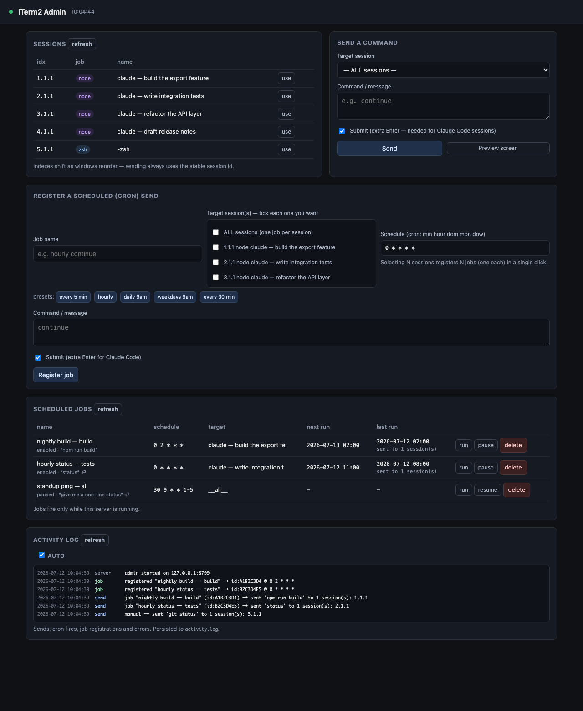

# itermon — terminal session monitor & controller (iTerm2 + tmux)

[](https://www.npmjs.com/package/itermon)
[](https://www.buymeacoffee.com/vectechlimited)

Monitor every running terminal session from one place, send commands to any of
them, and schedule recurring sends with cron — from a CLI, a local web admin,
or an MCP server. Speaks **iTerm2** natively on macOS, and **tmux** everywhere
else (see [Which terminal do you use?](#which-terminal-do-you-use) below).

> **Published on npm** as [`itermon`](https://www.npmjs.com/package/itermon):
> `npm install -g itermon` (needs Python 3.10+; iTerm2 on macOS, or tmux
> anywhere).

- **Two backends, one tool** — iTerm2's AppleScript interface on macOS, tmux
  everywhere else (Linux, SSH, or macOS if you opt in)
- **Zero dependencies** — pure Python 3 standard library; no `pip install`
- **No extra setup on either backend** — iTerm2 uses AppleScript (macOS will
  prompt once to allow automation; approve it) and needs no Python API or
  preference changes; tmux needs nothing beyond a running tmux server



<sub>The web admin: live session list, send panel, cron scheduler, and a live
activity log. Screenshot uses demo data. The web admin and cron scheduler are
macOS + iTerm2 only — see [Platform support](#platform-support).</sub>

---

## Which terminal do you use?

itermon speaks **iTerm2** natively on macOS, and speaks **tmux** everywhere
else — which means it works inside Ghostty, Warp, Alacritty, WezTerm,
Terminal.app, VS Code's integrated terminal, and **over SSH on a Linux box**.

**The honest cost, stated plainly: for any terminal other than iTerm2, you
must run your work inside tmux.** itermon can't attach to a terminal window
directly unless that terminal is iTerm2 on macOS — for everything else, tmux
is the thing itermon actually talks to, and tmux has to already be running
with the session you want to monitor inside it. That's real friction, once,
that you control; it isn't removable at any price (see
`docs/spikes/2026-08-06-terminal-universality-spike.md` for why: half the
terminal APIs that exist don't have a public scripting surface at all, and the
best-designed one that does — Ghostty's — can list and send but has no way to
read a screen).

If you're already on macOS with iTerm2, none of this matters — it works the
way it always has, with no tmux involved. See
[Choosing a backend](#choosing-a-backend) for how the two are selected.

---

## Features

- **Two backends** — iTerm2 (macOS) and tmux (everywhere, including SSH),
  selected automatically or explicitly (`--backend`, see below).
- **List** all sessions across every window/tab (or every tmux pane) with tty,
  foreground job, and a stable id.
- **Send** a command to one session, a matched subset, or all — from the CLI or a
  local web UI.
- **Read** any session's visible screen.
- **Watch** — a live auto-refreshing monitor.
- **Schedule** recurring sends with cron expressions (an in-process scheduler,
  macOS + iTerm2 only — see [Platform support](#platform-support)).
- **Activity log** — a live, timestamped feed of every send, cron fire, and error
  (macOS + iTerm2 only, same reason).
- **MCP server** — expose list/read/send to any MCP client (Claude Code, etc.)
  over stdio, zero dependencies, either backend.

---

## Requirements

- **Python 3.10+** — the actual engine, both backends
- Either **macOS with iTerm2** installed and running, **or** **tmux** installed
  and running (any OS) — see [Which terminal do you use?](#which-terminal-do-you-use)
- **Node.js 16+** — only to run the `npm` scripts (task runner); the CLI itself
  needs no Node at all if you run `iterm_ctl.py` / `iterm-ctl` directly

> **To run it you need no `npm install` and no `npm login`** — the project has
> zero npm dependencies; `npm` is only a task runner that shells out to the Python
> tool. (`npm login` is only for the maintainer publishing to the registry.)

### Install from npm (global)

```bash
npm install -g itermon
iterm-admin --open      # launch the web admin (macOS + iTerm2 only)
iterm-ctl list           # the CLI -- also available as `itermon` (same binary)
itermon backends         # what's available here, and what 'auto' would pick
```

---

## Quick start

```bash
git clone https://github.com/KuronokiCorp/usageMonitoring.git
cd usageMonitoring

npm start                  # web admin at http://127.0.0.1:8765
npm run start:open         # …and open it in your browser

# or use the CLI
npm run list
```

> `npm start` works straight after clone — **no `npm install` required** (zero
> dependencies). Requires Node 16+ and Python 3.10+.

The first run may trigger a one-time macOS prompt to allow controlling iTerm2 —
approve it.

---

## The CLI

Run via npm (pass CLI args after `--`):

```bash
npm run list                               # snapshot of all sessions
npm run watch                              # live monitor (Ctrl-C to stop)
npm run read -- 3.1.1                       # print a session's visible screen
npm run send -- 3.1.1 "git status"          # run a command in one session
npm run send -- --all "pwd"                 # run in every session (asks y/N)
```

Or, installed globally, run the binary directly (`iterm-ctl` or `itermon` —
same file, `iterm-ctl` is the original name and keeps working forever):

```bash
iterm-ctl list
iterm-ctl send 3.1.1 "git status"
itermon read 3.1.1
```

### Choosing a backend

`list`, `send`, `read`, and `watch` all take `--backend {auto,iterm2,tmux}`;
there's also the `$ITERMON_BACKEND` environment variable for scripted callers
(including the MCP server, which has no `--backend` flag of its own). Resolution
order:

1. the `--backend` flag, if it names a concrete backend (`iterm2` or `tmux`);
2. else `$ITERMON_BACKEND`, if set to `iterm2` or `tmux`;
3. else **auto**: **macOS → `iterm2`; every other platform → `tmux`.**

An unknown backend name (from either the flag or the environment variable) is a
clear, fail-closed error listing the valid choices — never a silent fallback to
something else.

> **`auto` never switches to tmux on macOS, even if you're already inside a
> tmux pane (`$TMUX` is set).** This is deliberate: today every macOS user gets
> iTerm2, and some of them run itermon *inside* tmux inside iTerm2 without
> itermon ever knowing. If `auto` preferred tmux whenever `$TMUX` was set,
> those users' `list` output would silently change shape on upgrade. macOS
> users who want the tmux backend opt in explicitly: `--backend tmux` or
> `ITERMON_BACKEND=tmux`.

```bash
iterm-ctl backends       # what's installed here, and what 'auto' would pick
iterm-ctl list --backend tmux
ITERMON_BACKEND=tmux iterm-ctl list
```

`iterm-ctl backends` prints the same capability table documented below, plus
which backend is available on this machine and which one `auto` resolves to.

#### Capabilities

The two backends are not identical — this is the honest difference, and it's
the same table `iterm-ctl backends` prints:

| Capability | iterm2 | tmux | Meaning |
|---|---|---|---|
| `stable_ids` | no | yes | `Session.id` survives structural change (iTerm2's index renumbers on window reorder; tmux's `%id` does not) |
| `job_column` | yes | yes | the JOB column is populated |
| `job_via_ps` | yes | no | job comes from a `ps -t <tty>` shell-out (iTerm2) vs. straight from the terminal (tmux) |
| `cwd` | no | yes | `Session.cwd` is populated |
| `scrollback` | no | yes | the backend *could* read beyond the visible screen (not exposed yet — its own future flag) |
| `needs_os_permission` | yes | no | macOS TCC automation grant required on first use |
| `cross_platform` | no | yes | works off macOS |

### Targeting a session

`send` and `read` accept any of these selectors:

| Selector        | Example         | Notes                                            |
|-----------------|-----------------|--------------------------------------------------|
| index           | `3.1.1` (iTerm2) / `work:2.0` (tmux) | window.tab.session (iTerm2) or session:window.pane (tmux). **Positional on iTerm2 — shifts when windows open/close; tmux pane addresses don't have this problem (see below).** |
| bare id         | `%3` (tmux)     | tmux pane id, typed bare — same as `id:%3`       |
| `id:PREFIX`     | `id:C86EE5` (iTerm2) / `id:%3` (tmux) | matches the stable id (UUID prefix on iTerm2, exact `%N` on tmux). **Most reliable on iTerm2.** |
| `tty:NNN`       | `tty:ttys002`   | matches the device tty                           |
| `name:REGEX`    | `name:daily`    | case-insensitive **search** (unanchored) on the title (iTerm2) / tmux window name |
| substring       | `AdMobs`        | case-insensitive substring of the title/window name |
| `--all`         | —               | every session/pane                               |

> **On iTerm2, prefer `id:` for anything scripted.** iTerm renumbers windows
> constantly (the frontmost becomes window 1), so `3.1.1` can point at a
> different session minute to minute; the UUID never moves. **tmux pane ids
> (`%N`) don't have this problem** — they're stable for the life of the tmux
> server, proven by killing a neighbouring pane and confirming the survivor
> keeps its id (see `docs/spikes/2026-08-06-terminal-universality-spike.md`).

### Windows, tabs, and split panes

iTerm's structure is **window → tab → session** (a "session" is a single pane),
and the index is `window.tab.session`, all 1-based. Everything is enumerated at
every level, so one iTerm with many windows — or windows with many tabs, or tabs
split into panes — is fully handled, one row per pane:

```
1.1.1   window 1, tab 1, pane 1
1.2.1   window 1, tab 2, pane 1
1.2.2   window 1, tab 2, pane 2   ← a split pane
2.1.1   window 2, tab 1, pane 1
```

Every pane, however deeply nested, gets its own stable UUID and can be targeted
individually (or with `--all`, which hits every pane in every tab in every
window). Only the leading window number is positional — the frontmost window is
always window 1, so those numbers shift as you focus/open/close windows; the
UUID does not, which is why scheduled jobs target by `id:`.

On the **tmux backend**, the equivalent structure is **session → window →
pane**, and the index is `session:window.pane` (e.g. `work:2.0`), which is
also how tmux itself already lets you address a pane — there's nothing new to
learn. `--all` hits every pane on the tmux server, across every session.

### `send` flags

- `--no-enter` — type the text without pressing Return.
- `--yes` / `-y` — skip the confirmation on `--all` / multi-match sends.

---

## The web admin

```bash
npm start                    # http://127.0.0.1:8765
npm run start:open           # …and open the browser
npm start -- --port 9000     # custom port
```

Bound to `127.0.0.1` only (local, no auth). Panels:

1. **Sessions** — live auto-refreshing list; click *use* to target one.
2. **Send a command** — pick a session, type a message, Send. The **Submit**
   checkbox adds an extra Enter that Claude Code's TUI needs (leave it on for
   Claude sessions, off for a plain shell). *Preview screen* dumps the current
   contents.
3. **Scheduled (cron) sends** — register recurring jobs (see below).
4. **Activity log** — a live, colour-coded feed of what the tool does.

### Registering scheduled jobs

Give a job a name, **tick one or more target sessions** (a checkbox list — one
job is created per ticked session; ticking **"ALL sessions"** expands to one job
per current session so each is individually pauseable/deletable), a message, and
a 5-field cron expression (`min hour day month weekday`), with preset buttons
(every 5 min, hourly, daily 9am, weekdays 9am…). Jobs show their next/last run
and can be run-now, paused, or deleted. Targets are stored by **session UUID**,
so a job keeps hitting the right session even as iTerm reorders windows.

**How the scheduler runs:** an in-process thread wakes ~once a minute (aligned
just past each minute boundary), tests every job's cron expression against the
current minute, and fires the matches. Jobs persist to `iterm_jobs.json` and
survive restarts, but **only fire while the server is running** — this is
deliberate, because driving iTerm needs the automation permission the server
inherits from your terminal, which a plain system `crontab` usually lacks.

### Activity log

The admin's **Activity log** panel shows a live feed of what the tool does —
manual sends, cron fires (with which sessions were hit), job registrations, and
errors — each timestamped and colour-coded. It's persisted to `activity.log` so
history survives a restart, and served at `GET /api/logs`.

---

## MCP server

`iterm_mcp.py` exposes itermon's core primitives to any **Model Context Protocol**
client (Claude Code, Claude Desktop, etc.) over the MCP **stdio** transport. It
speaks JSON-RPC 2.0, has **zero dependencies** (pure Python 3 standard library,
like the rest of itermon), and uses the same backend seam as the CLI — iTerm2
on macOS, tmux everywhere else. There's no MCP tool argument for it; set
`$ITERMON_BACKEND` (`iterm2` or `tmux`) in the server's environment (e.g. in
`.mcp.json`'s `"env"`) to pick one explicitly — see
[Choosing a backend](#choosing-a-backend).

### Tools

| Tool            | Arguments                              | What it does                                             |
|-----------------|----------------------------------------|----------------------------------------------------------|
| `list_sessions` | *(none)*                               | List every session/pane (on the active backend) with index, id, tty, title, and foreground job. |
| `read_screen`   | `target`                               | Read the visible screen of the matching session(s).      |
| `send_command`  | `target`, `command`, `enter` *(opt)*   | Type text into the matching session(s), optionally pressing Enter. Refuses when the target matches nothing. |

`target` accepts the same selectors as the CLI — an index (`2.1.1` on iTerm2,
`work:2.0` on tmux), `id:<prefix-or-exact>`, `tty:<suffix>`, `name:<regex>`, or
a bare substring of the title (see [Targeting a session](#targeting-a-session)).

### Setup

Installed globally from npm, the server is on your `PATH` as `itermon-mcp`.
Register it in a project's `.mcp.json` (or your client's MCP config):

```json
{
  "mcpServers": {
    "itermon": {
      "command": "itermon-mcp"
    }
  }
}
```

Running from a clone instead? Point at the file directly:

```json
{
  "mcpServers": {
    "itermon": {
      "command": "python3",
      "args": ["/absolute/path/to/iterm_mcp.py"]
    }
  }
}
```

You can also launch it via npm for a quick check: `npm run mcp`.

The first tool call may trigger the one-time macOS prompt to allow controlling
iTerm2 — approve it, same as the CLI.

> **Safety:** `send_command` types into whatever session matches `target`,
> including sessions running Claude Code. It refuses to run when nothing matches,
> but it does **not** ask for confirmation — the MCP client is responsible for
> that. Target a specific `id:` rather than a positional index for anything you
> don't want to misfire.

---

## How it works

`iterm_ctl.py` wraps the same three primitives — **list**, **send**, **read**
— behind a small backend seam, with one implementation per terminal:

- **iTerm2 backend** (macOS): everything rests on iTerm2's AppleScript
  interface, via `osascript`. **list** walks windows → tabs → sessions,
  reading UUID / tty / title; **send** is `write text` to a session found by
  UUID (optionally with Enter); **read** is `get contents` of a session's
  visible screen.
- **tmux backend** (any OS): everything rests on the real `tmux` binary.
  **list** is one `tmux list-panes` call; **send** is `tmux send-keys -l --`
  (literal mode, mandatory — see the targeting table's stability note) plus a
  separate `Enter` call when requested; **read** is `tmux capture-pane -p`.

Which one runs is decided once per invocation by [backend
selection](#choosing-a-backend); everything above it (the CLI, the web admin,
the MCP server) calls the same four functions regardless of which backend
answered.

`iterm_web.py` is a stdlib HTTP server exposing those over JSON, plus the cron
scheduler thread and the activity log — **iTerm2 backend only**, see
[Platform support](#platform-support).

### Platform support

| Component | macOS | Linux / other |
|---|---|---|
| CLI (`iterm-ctl` / `itermon`) | iTerm2 or tmux (`--backend`) | tmux |
| MCP server (`itermon-mcp`) | iTerm2 or tmux (`$ITERMON_BACKEND`) | tmux |
| Web admin (`iterm-admin`) | **iTerm2 only** | not available |
| Cron scheduler | **iTerm2 only** (runs inside the web admin) | not available |

The web admin and its cron scheduler are a macOS + iTerm2 tool; they are not
part of this release's tmux work and the README isn't pretending otherwise —
if you need scheduled sends on Linux, use your own `cron` calling
`iterm-ctl send` directly.

---

## Files

| File             | What it is                                             |
|------------------|--------------------------------------------------------|
| `iterm_ctl.py`   | CLI + the AppleScript primitives (list / send / read / watch) |
| `iterm_web.py`   | Local web admin + in-process cron scheduler + activity log |
| `iterm_mcp.py`   | MCP stdio server (`itermon-mcp`) exposing list / read / send |
| `start.sh`       | Launches the web server                                |
| `iterm_jobs.json`| Saved scheduled jobs (created at runtime, gitignored)  |
| `activity.log`   | Activity-log history (created at runtime, gitignored)  |

---

## Publishing (maintainers)

Published to npm as [`itermon`](https://www.npmjs.com/package/itermon).
Publishing requires an npm **Automation** token (bypasses 2FA) in `.env` as
`NPM_TOKEN`. To release a new version:

```bash
# 1. bump "version" in package.json
# 2. publish (reads NPM_TOKEN from .env)
npm run publish:npm
```

`npm pack --dry-run` lists exactly what ships — the `files` allowlist in
`package.json` ensures `.env`, `activity.log`, and `iterm_jobs.json` never do.

---

## Notes & limitations

- **The web admin and cron scheduler are macOS + iTerm2 only.** The CLI and
  MCP server work on iTerm2 (macOS) or tmux (any OS) — see
  [Platform support](#platform-support).
- **For any terminal other than iTerm2, your session has to be inside tmux.**
  itermon doesn't launch or attach to a terminal window directly except on
  iTerm2/macOS; see [Which terminal do you use?](#which-terminal-do-you-use).
- **Scheduled jobs run only while the web server is running.**
- **`send --all` types into every session**, including ones running Claude Code —
  a y/N confirmation (CLI) is the only guard. Prefer targeting a specific `id:`.
- **Sending into a Claude Code session takes an extra Enter** to submit (the TUI
  treats a pasted newline as a literal newline); the web UI's *Submit* checkbox
  handles this automatically.
- **tmux scrollback is not exposed yet.** tmux can read beyond the visible
  screen (`capture-pane -S`); itermon knows this (`scrollback` in the
  capability table) but doesn't expose it this release — `read_contents()`
  means "the visible screen" for every existing caller today, and widening
  that silently would change what a cron-timer monitoring tool returns. It's
  a candidate for its own flag later.

---

## Support

itermon is free and zero-dependency. If it saves you time, you can support its
development:

<a href="https://www.buymeacoffee.com/vectechlimited" target="_blank">
  
</a>

Or scan:


